# Academia: Software Documentation

**Team:** 9

| Last Name     | First Name     |
|---------------|----------------|
| Aemmer | Oliver |
| Fuhrer | Jan |
| Hadorn | Mario |
| Lauber | Jan |

**Revision History**


| Version | Date         | Description| Author          |
|---------|--------------|------------|-----------------|
| 1.0     | Sep 20, 2021 | Template   | Stephan Fischli |
| 1.1     | Feb 18, 2022 | Chapter 2  | Urs Kuenzler    |
| 1.2     | Apr 22, 2022 | Chapter 4, 6.2, 6.7, 7 | Mario Hadorn |
| 1.3     | Apr 23, 2022 | Chapter 5.3, 6.4, 6.5 | Jan Lauber |
| 1.4     | Apr 23, 2022 | Chapter 5, 6.3 | Jan Fuhrer |
| 1.5     | Apr 23, 2022 | Chapter 2, 5.2 | Oliver Aemmer |
| 1.6     | Apr 23, 2022 | Chapter 5.3.1, 6.1 | Jan Fuhrer, Mario Hadorn |
| 1.7     | Apr 23, 2022 | Chapter 8, 9 | Jan Lauber |
| 1.8     | Apr 23, 2022 | Final version | Jan Lauber, Mario Hadorn, Oliver Aemmer, Jan Fuhrer |

<div style="page-break-before: always"/>

## Contents

**[1. Audience](#section1)**  
**[2. Project Vision](#section2)**  
**[3. Use Cases](#section3)**  
**[4. Architecture](#section4)**  
[4.1 Presentation tier](#section4.1)  
[4.2 Application tier](#section4.2)  
[4.3 Data tier](#section4.3)  
[4.4 Component diagram](#section4.4)  
**[5. Design](#section5)**  
[5.1 Static View](#section5.1)  
[5.2 Dynamic View](#section5.2)  
[5.3 Design Decisions](#section5.3)  
**[6. Implementation](#section6)**  
[6.1 Persistence](#section6.1)  
[6.2 Transaction management](#section6.2)  
[6.3 Authentication & Authorization](#section6.3)  
[6.4 User Interface](#section6.4)  
[6.5 Session handling](#section6.5)  
[6.6 Error handling](#section6.6)  
[6.7 Logging](#section6.7)  
**[7. Testing](#section7)**  
[7.1 Frontend Tests](#section7.1)  
[7.2 Backend Tests](#section7.2)  
**[8. Operations](#section8)**  
[8.1 Deployment diagram](#section8.1)  
[8.2 System configuration](#section8.2)  
[8.3 Installation](#section8.3)  
**[9. Conclusion](#section9)**


<div id="section1" style="page-break-before: always"/>

## 1. Audience

This documentation gives an overview of the "academia" project, its design and the technical aspects of how it was built.
Therefore, the target audience falls in the following roles:
- Software engineers
- PT3 Instructors
- PT3 Students

The target audience has basic knowledge in the following topics:
- Java programming language
- SQL Databases with Postgres
- React and the next.js Framework
- Material UI CSS Framework


<div id="section2" style="page-break-before: always"/>

## 2. Project Vision

The following context diagram shows a high level overview of the external actors of the Academia system and how they interact with each other.

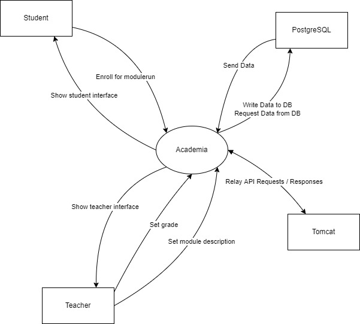

The main goal of Academia is to provide a platform for students and teachers to exchange information regarding modules, moduleruns, grades and enrollments.

#### System

The frontend of Academia consists of a single page application (SPA) with which the user will interact. The backend will consist of a server application which is connected to a database.
Communication between SPA and server application will happen over HTTP requests and HTTP responses which will be handled by a Tomcat web container. Tomcat receives HTTP requests from the SPA, relays them to the corresponding internal servlets and sends HTTP responses back to the SPA.
To persist data Academia will use internal repositories to send SQL queries to a PostgreSQL database which will send back the results of said queries.

#### Student

A student requires an overview of all moduleruns and, if available, the corresponding grade to a modulerun. Further the student needs to be able to enroll or unenroll for a given modulerun.

#### Teacher

A teacher requires an overview of moduleruns which she/he teaches with the additional information of the enrolled students per modulerun. Teachers require the ability to set grades for enrolled students and change module descriptions of modules they coordinate.

To achieve these functional goals the software needs to meet certain criterias:

#### Authentication

Users are required to authenticated themselves to access the system. This is achieved with a user / password pair and an additional bearer token to make recurring authentications easier and faster.

#### API

The API is required to follow the RESTful architecture and provide a coherent web interface for the SPA.

#### Locking

To make Academia a multi user application, optimistic locking will be applied to avoid data inconsistency.

#### Multi-role-application

The SPA is required to support multiple roles which allows students and teachers to work in the same application.

#### Security

The SPA is required to only display functions which correspond to the currently logged in user. The server application is required to verify a user on each request and authorize the request based on the users role and user ID.

#### Error handling

Both SPA and server application are required to provide adequate error handling to inform the user in case an error occurs. Server application errors will be communicated to the SPA over HTTP status codes.


<div id="section3" style="page-break-before: always"/>

## 3. Use Cases

### Use Case Diagram

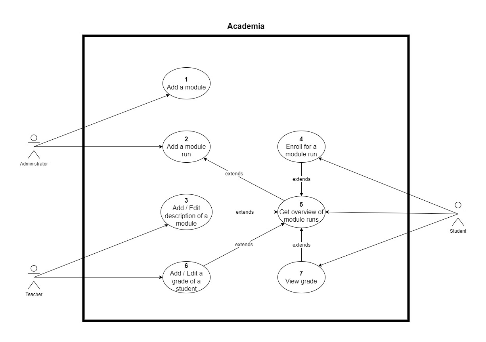

| Use Case 1    | Add a module                                                                                                                                                                 |
|---------------|------------------------------------------------------------------------------------------------------------------------------------------------------------------------------|
| Actors        | Administrator (This use case is not implemented because it is not in the scope of the 4 ETCS Project and Training 3 module)                                                                                                                                                             |
| Trigger       | The school decides to teach an additional module                                                                                                                             |
| Precondition  | The administrator is logged into Academia                                                                                                                                    |
| Scenario      | 1. The administrator opens the "new module" form<br />2. The administrator enters the name of the module, description of module and the teacher who will coordinate the module |
| Error         |                                                                                                                                                                              |
| Result        | The module is added                                                                                                                                                          |
| Postcondition | A modulerun of the created module can be created                                                                                                                            |

|Use Case 2     |Add a modulerun                                                                                                                                                                   |
|---            |---                                                                                                                                                                                |
|Actors         |Administrator (This use case is not implemented because it is not in the scope of the 4 ETCS Project and Training 3 module)                                                                                                                                                                    |
|Trigger        |The school decides to teach an additional modulerun                                                                                                                                   |
|Precondition   |The module is added<br />The administrator is logged into Academia                                                                                                                   |
|Scenario       |1. The administrator opens the module overview<br />2. The administrator chooses a module<br />3. The administrator defines in which year and semester the modulerun will take place  |
|Error          |                                                                                                                                                                                   |
|Result         |The modulerun is added                                                                                                                                                            |
|Postcondition  |A student can enroll for a modulerun                                                                                                                                              |

|Use Case 3     |Add / Edit description of a module                                                                                                                                               
|---            |---                                                                                                                                                                                |
|Actors         |Teacher                                                                                                                                                                            |
|Trigger        |The description of a module changes                                                                                                                                                |
|Precondition   |The module is added<br />The teacher is logged into Academia<br />The teacher is assigned a coordinator of the chosen module                                                           |
|Scenario       |1. The teacher opens the module overview<br />2. The teacher chooses a module<br />3. The teacher changes / adds the module description                                                |
|Error          |                                                                                                                                                                                   |
|Result         |The description of a module is changed / added                                                                                                                                     |
|Postcondition  |A module has a new description                                                                                                                                                     |

|Use Case 4     |Enroll for a modulerun                                                                                                                                                            |
|---            |---                                                                                                                                                                                |
|Description    |The student chooses a modulerun and enrolls for it                                                                                                                                |
|Actors         |Student                                                                                                                                                                            |
|Trigger        |The student wants to enroll for a modulerun                                                                                                                                       |
|Precondition   |The chosen modulerun has to be defined by the administrator<br />The student is logged into Academia                                                                                |
|Scenario       |1. The student opens the modulerun overview of a given term<br />2. The Student chooses a modulerun to enroll in                                                                   |
|Error          |                                                                                                                                                            |
|Result         |The student is enrolled in the chosen modulerun                                                                                                                                   |
|Postcondition  |The teacher of the chosen modulerun can give the student a grade                                                                                                                  |

|Use Case 5     |Get overview of moduleruns|
|---            |---|
|Description    |The student gets an overview of the moduleruns of a given term|
|Actors         |Student                                                                                                                                                                            |
|Trigger        |The student wants to see which modules he is enrolled for                                                                                                                          |
|Precondition   |The student is logged into Academia                                                                                                                                                |
|Scenario       |1. The student opens the modulerun overview of a given term<br />2. The overview is shown                                                                                           |
|Error          |No modules to show because the student hasn't enrolled for any moduleruns                                                                                                         |                                                  |
|Result         |The student has an overview over his moduleruns                                                                                                                                   |
|Postcondition  |                                                                                                                                                                                   |

|Use Case 6     |Add / Edit a grade of a student                                                                                                                                                    |
|---            |---                                                                                                                                                                                |
|Actors         |Teacher                                                                                                                                                                            |
|Trigger        |The term is over and the teacher wants to grade his students                                                                                                                       |
|Precondition   |At least one student is enrolled for his modulerun<br />The teacher is logged into Academia                                                                                         |
|Scenario       |1. The teacher opens module overview<br />2. The teacher chooses a modulerun and student<br />3. The teacher sets / edits a grade                                                     |
|Error          |                                                                                                                                                                                   |
|Result         |The modulerun of a student is graded                                                                                                                                              |
|Postcondition  |The student can see his grade in his module overview                                                                                                                               |

|Use Case 7     |View grade                                                                                                                                                                        |
|---            |---                                                                                                                                                                                |
|Description    |The student checks his grade on a given modulerun                                                                                                                                 |
|Actors         |Student                                                                                                                                                                            |
|Trigger        |The student wants to know his grade for a given modulerun                                                                                                                         |
|Precondition   |The teacher has graded his modulerun                                                                                                                                              |
|Scenario       |1. The student opens the modulerun overview of a given term<br />2. The student chooses a modulerun<br />3. The students grade is shown                                              |
|Error          |The modulerun hasn't been graded by the teacher                                                                                                                                   |
|Result         |The student knows his grade for a give modulerun                                                                                                                                  |
|Postcondition  |                                                                                                                                                                                   |                                                                                                                                                                         |

<div id="section4" style="page-break-before: always"/>

## 4. Architecture

Academia is built on a multi-layer architecture, more specifically on the three-tier architecture.  The three-tier architecture consists of three components: the presentation tier, the application tier and the data tier. The three tiers are described in detail below:

<div id="section4.1"/>

### 4.1 Presentation tier
The presentation tier is the user interface of the application, where the user interacts with the system. The main function is displaying information to and receiving information from the user. This tier is the only way for the user to interact with the system, thus he cannot access the other tiers directly.

For academia, this is the website that is presented to the user.

A REST interface is used to communicate between the presentation tier and the application tier. The data required by the presentation tier is requested and received exclusively via this interface.

<div id="section4.2"/>

### 4.2 Application tier
The application tier, also called middle tier or logic tier, is the core of the application. This is where the information collected from the presentation tier is processed. The application tier can also edit, add or delete data in the data tier.

In the academia application, the entire user and module management takes place in this tier. Besides, it is responsible for the authorisation and authentication of the application witch is accomplished by the use of filters.
Eventually, the SQL database is also manipulated by this tier using JDBC.

<div id="section4.3"/>

### 4.3 Data tier
The data tier, sometimes called the back-end or database tier, is where the information needed by the application is stored and managed. In this tier, relational database systems are mostly used.
In the three-tier architecture, all communication goes through the application tier. The presentation tier cannot communicate directly with the data tier and vice versa.

In the academia application, a PostgreSQL database is used for this purpose. The data is handled exclusively by the application tier using JDBC.

<div id="section4.4"/>

### 4.4 Component diagram
Below is the component diagram of academia. The presentation tier is represented by the web frontend component. This communicates via REST interface with the application tier which contains the user management component, the module management component as well as the filters.
The application tier communicates via SQL interface (JDBC) with the data tier which is represented by the PostgreSQL Database component.

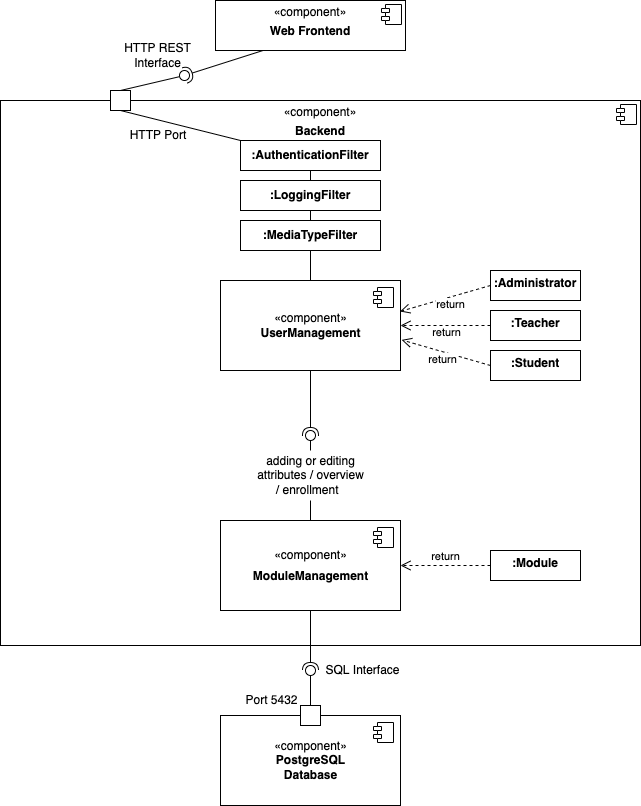

<div id="section5" style="page-break-before: always"/>

## 5. Design

<div id="section5.1"/>

### 5.1 Static View

#### 5.1.1 Domain Level Class Diagram


At the Domain Level, there are two main parts:

**1. User-Management**

The User-Management manages all users that interact with the application. There are two roles available: *teacher* and *student*. Each user of the application is assigned a role. Depending on the role, the user has different rights and possibilities to interact within the application.

**2. Module-Management**

The Module-Management manages all modules in the application. Each module can have zero, one or more moduleruns.

**Relationships**

- only a user with the role *teacher* can teach a specific modulerun
- only a user with the role *student* can enroll himself to a modulerun
- on every enrollment, a grade can be set

#### 5.1.2 Class Diagram

**Overview**


The backend is split up into the following six packages:

- Authentication
- Enrollment
- Module
- Modulerun
- Person
- Util

**Authentication Package**


| Class name | Description |
| ---------- | ----------- |
| AuthenticationController | HTTP-Servlet controller for the REST-Endpoint `/api/auth` |
| AuthenticationFilter | Check the authentication on every HTTP-Request |
| AuthLogin | Object-Class for request-body on `POST`-Method at `api/auth` |
| AuthResponse | Object-Class for response-body on `GET`-Method at `/api/auth` |

**Enrollment Package**

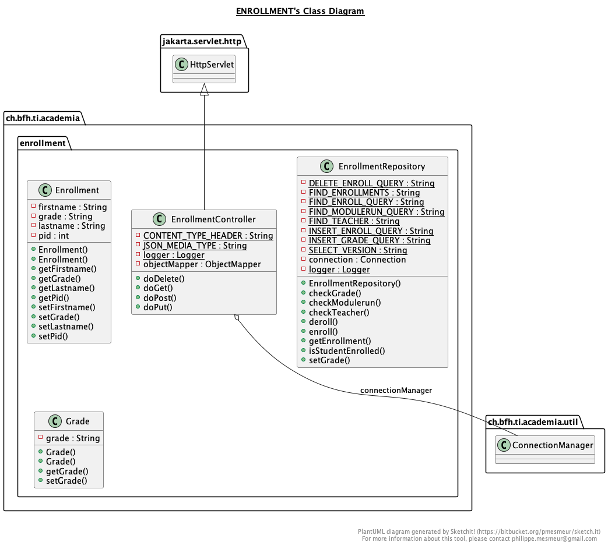

| Class name | Description |
| ---------- | ----------- |
| Enrollment | Enrollment-Object |
| EnrollmentController |  HTTP-Servlet controller for the REST-Endpoint `/api/enrollments` |
| EnrollmentRepository | Provides all CRUD-methods (create, retrive, update, delete) of an enrollment in the database |
| Grade | Grade-Object for request-body on `PUT`-Method at `/api/enrollments` |

**Module Package**

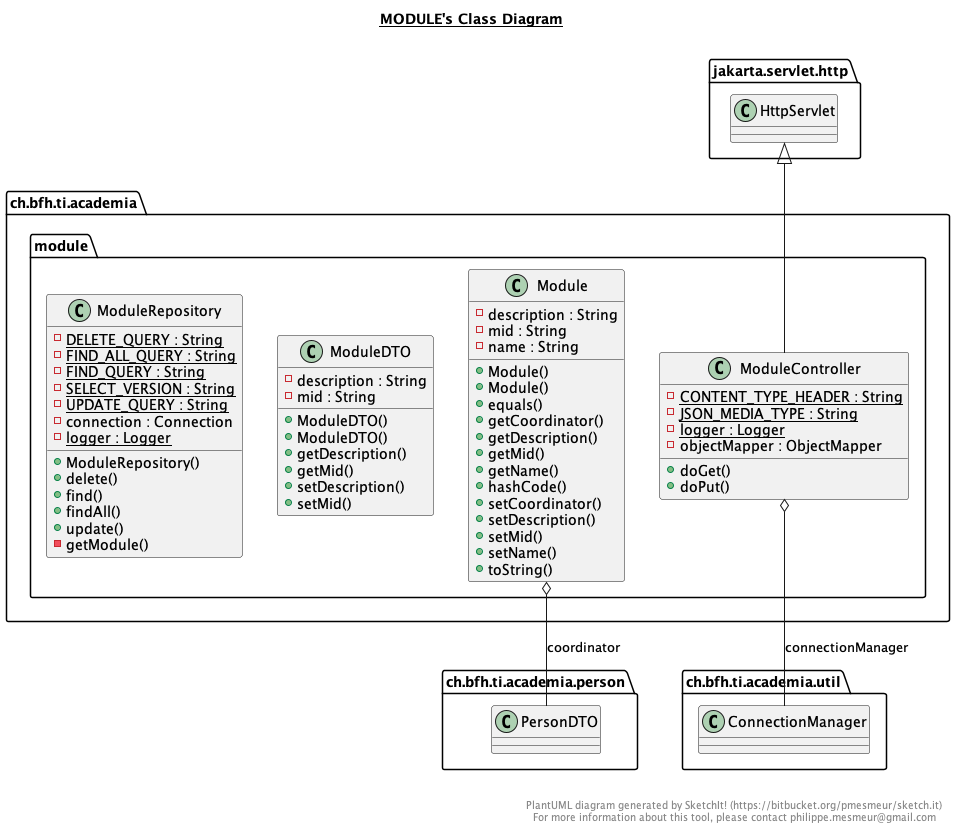

| Class name | Description |
| ---------- | ----------- |
| Module | Module-Object |
| ModuleController | HTTP-Servlet controller for the REST-Endpoint `/api/modules/` |
| ModuleDTO | Data Transfer Object (DTO) for a module: flat data structure of a module object  |
| ModuleRepository | Provides database-specific methods to obtain information or update a module |

**Modulerun Package**


| Class name | Description |
| ---------- | ----------- |
| Modulerun | Modulerun-Object |
| ModulerunController | HTTP-Servlet controller for the REST-Endpoint `/api/moduleruns/` |
| ModulerunRepository | Provides database-specific methods to obtain information about a modulerun |

**Person Package**

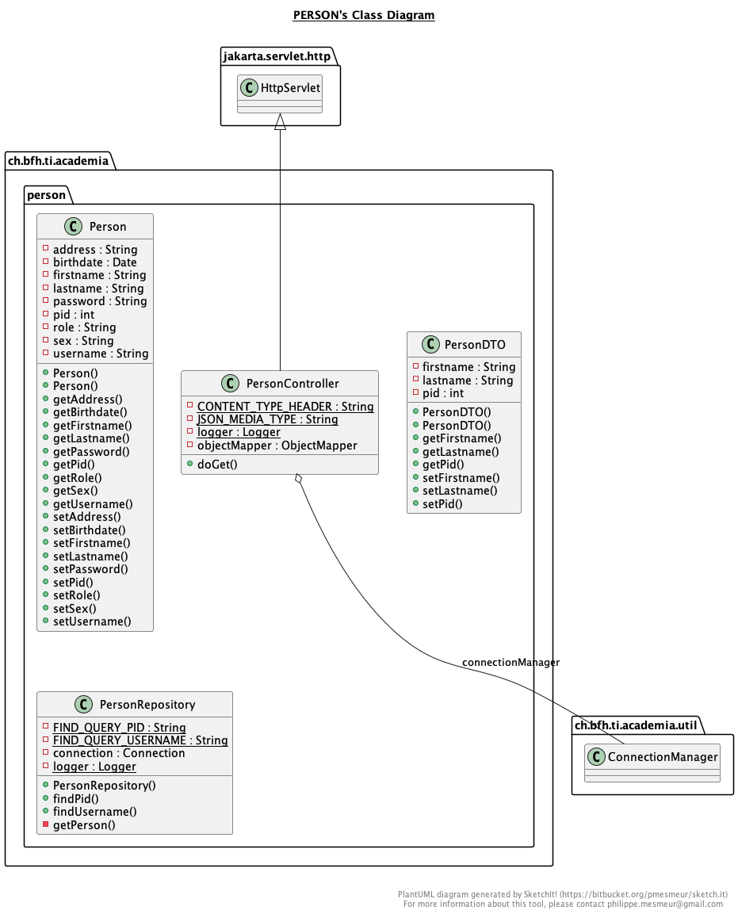

| Class name | Description |
| ---------- | ----------- |
| Person | Person-Object |
| PersonController | HTTP-Servlet controller for the REST-Endpoint `/api/persons/` |
| PersonDTO | Data Transfer Object (DTO) for a person: flat data structure of a person object |
| PersonRepository | Provides database-specific methods to obtain information about a person |

**Util Package**


| Class name | Description |
| ---------- | ----------- |
| ConnectionManager | Used to manage database connections |
| LoggingFilter | Logging every HTTP-Request |
| MediaTypeFilter | Checks with every HTTP request whether the mandatory HTTP headers are set correctly |
| ObjectMapperFactory | Object mapper for HTTP-Requests and -Responses |

#### 5.1.3 ERD

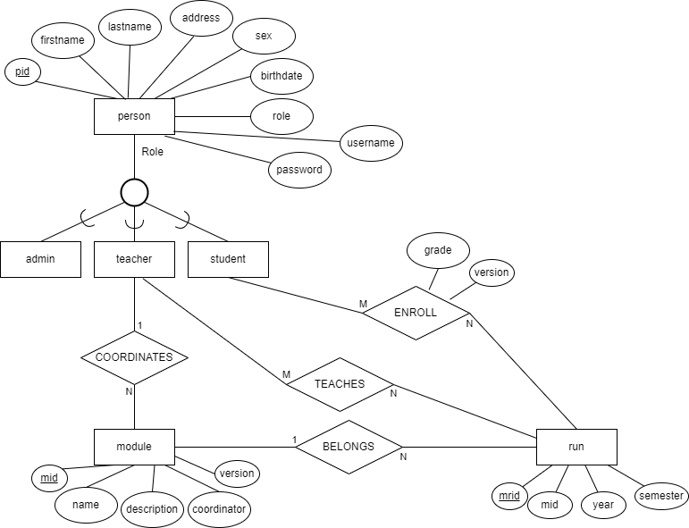

The entity relationsship model consists of three entities: person, module and run.

**Entity person**

The entity person contains all relevant attributes of a person including username and password. There are two sub-classes which are defined by the attribut *role*, which can be *teacher* or *student*. The hierarchy is disjoint and complete, thus every person has to be exactly in one sub-class. A person is identified by the attribute pid.

**Entity module**

This entity contains all relevant attributes of a module, identified by the id of the module (mid).

**Entity run**

The run entity represents the runs of a module, identified by the id of the modulerun (mrid).

**Relationships**

There are four relationships between the mentioned entities:

1. A module has exactly one teacher, who acts as coordinator of the module. A coordinator has extended rights in the management of the module (e.g. change module description)
2. A run belongs to exactly one module. A module can have multiple runs.
3. Every run has multiple teachers (person with role *teacher*). A teacher can teach multiple runs.
4. A student can be enrolled on multiple runs, a run can have multiple enrolled students. The two additional attributes grade and version belong to this relationship.

#### 5.1.4 Database Schema


Based on the ERD, the above scheme was defined. The two N-to-M relationships have been mapped in their own auxiliary relation (teacher_run and enroll).

#### 5.1.5 REST Interface

The complete REST Interface definition according to the [openAPI specification](https://swagger.io/specification/) is available in the file [openAPI3.0.yaml](../resources/openAPI3.0.yaml). Below are all provided endpoints and methods listed as an overview.

| Endpoint | Method | Description | Authorization |
| -------- | ------ | ----------- | ------------- |
| `/api/auth` | `GET` | Obtain information about the logged in user and check if the bearer token is valid. | all authenticated users |
| `/api/auth` | `POST` | Receive a new bearer token (login). | all users |
| `/api/persons` | `GET` | Obtain information about a person. | as teacher about all persons, as student only its own information |
| `/api/modules` | `GET` | Get information about a single or all available modules. | all authenticated users |
| `/api/modules` | `PUT` | Update the description of a module. | only the coordinator of the module |
| `/api/moduleruns` | `GET` | Get all moduleruns. A user with role *teacher* receives all moduleruns which he teaches, a user with role *student* receives all available moduleruns. | all authenticated users |
| `/api/enrollments` | `GET` | Obtain information about an existing enrollment. | all students and all teachers who teach the modulerun |
| `/api/enrollments` | `POST` | Create a new enrollment. | only students |
| `/api/enrollments` | `PUT` | Set grade of an existing enrollment. | only teacher who teach the modulerun |
| `/api/enrollments` | `DELETE` | Delete an existing enrollment. | only students |

<div id="section5.2"/>

### 5.2 Dynamic View

#### Enrollment
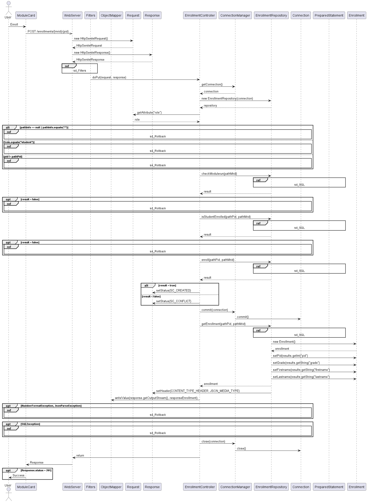

This sequence diagram displays the process of enrollment including error handling.

#### Grade
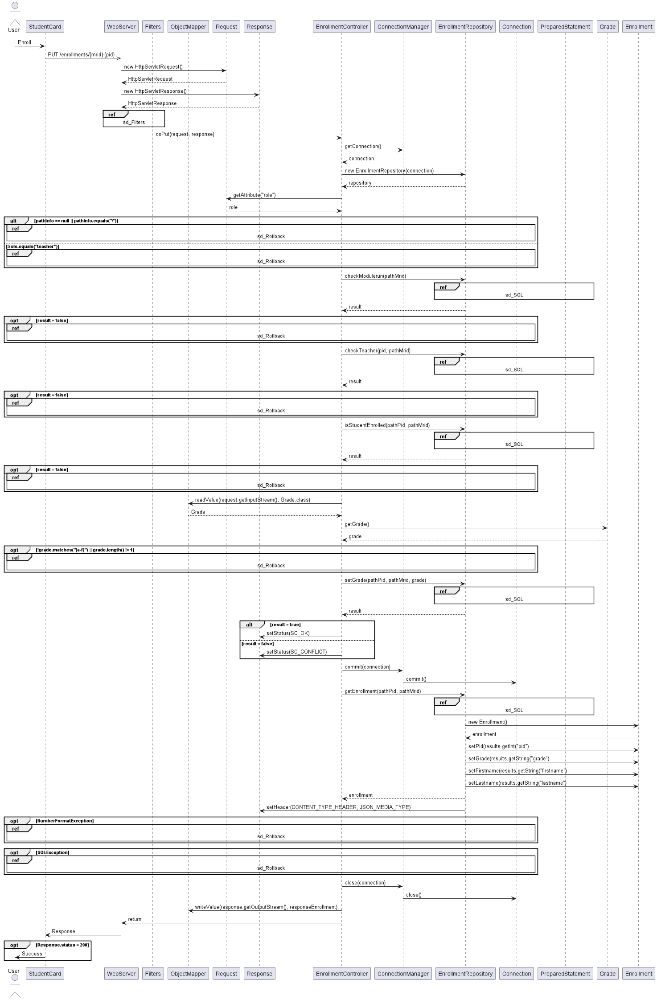

This sequence diagram displays the process of setting a grade including error handling.

#### SQL


This sequence diagram displays the preparement and execution of an SQL query.

#### Rollback
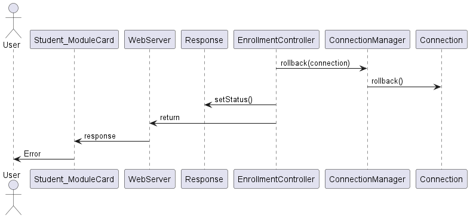

This sequence diagram displays the connection rollback process including error delivery to the user.

#### Filters


This sequence diagram displays the filter chain and used filters.

<div id="section5.3"/>

### 5.3 Design Decisions

#### 5.3.1 Authorization concept
The authorization concept is based on the evaluation of the JSON Web Token (JWT) token. Several values are stored in the JWT token, which are queried for each API request (except `POST` on `/api/auth` and `OPTION`):
- pid
- role

This data allows the backend to check whether the request with the *pid* and *role* has permission to access the requested API data.

So the response data depends on the **role** a user has -> `student` or `teacher`.

**Backend Design Decisions**

Instead of Basic Auth, JWT is used, to add additional information inside the authentication process. As an additional advantage, it is not necessary to make multiple SQL-Statements to get information about the user (e.g. pid and role). Furthermore there is a widely established library for the Implementation of JWT in Java (auth0).


**Frontend Design Decisions**

Since the *NextJS* framework is used to build the frontend, React Contexts are available.
A React Context is a component that can be accessed from any other component.
There is an `Auth` Context at `src/main/webapp/_src/contexts/Auth.js` that exports the following:
- **useAuth()** -> function to create a constant inside a component (e.g. `const authenticate = useAuth()`) to get the following data:
    - **user** -> will be set during authentication with the values from the api endpoint `/api/auth` (e.g. pid, role)
    - **person** -> set on authentication with the values from the `/api/persons/{pid}` api endpoint (e.g. first name, last name, pid, ...)
    - **loading** -> bool set to true, but when all authentication api calls are made, set to false.

The whole component exports an **\<AuthContext \/>** which is wrapped around the whole application in `src/main/webapp/_src/pages/_app.js`. Each child is checked if the user is authenticated or the route is `/` (login page). If the user is not authenticated he is redirected to the login page or if authenticated he is redirected to the overview page.

AuthContext makes an api *GET* call on `/api/auth` and if OK, a cookie is set in the browser's local storage to send the required JWT token for authentication/authorization in the HTTP Authorization header.
This check is always performed to verify that the user is still logged in.

<div id="section6" style="page-break-before: always"/>

## 6. Implementation

<div id="section6.1"/>

### 6.1 Persistence
All persistent data is stored in a local database. For the implementation, a PostgreSQL database is used. To initialize the database, two scripts are used to set up the relations and data.


For every HTTP request body, the received JSON is mapped to an object with an Object-Mapper-Factory. An object is also mapped to JSON for the response body.
The DTO pattern (Data Transfer Object) is used because only a subset of the object attributes is used for certain responses.


<div id="section6.2"/>

### 6.2 Transaction management
To maintain persistence of the data, optimistic locking with version number is used in the database. For this purpose, the version field was added to all the tables in which the data can be modified with academia. As can be seen in the ERD diagram (Chapter 5.1.3), the module and enroll tables have this version number as a data field.

The version field of the desired record is read out and stored in a variable before an update is executed on the database. The update is then only carried out if the version in the variable matches the version in the database. This ensures that the record has not been modified in the interim.

The SQL commands for modifying the modules are shown below as an example.

```sql
-- Return the Version number of the desired module to save into an variable
SELECT version FROM module WHERE mid = 'BTI1111'

-- Update the desired module with version check
UPDATE module SET name = 'JAVA 1', description = 'Java for beginners', version = 2 WHERE mid ='BTI1111' AND version = 1
```

The SQL commands show how the approach with version numbers is kept simple. In the example, the select statement would return version number 1. When updating, the system checks whether the version number is still 1, and if so, the update is carried out and version number 2 is saved. However, if an update has already been executed in between, the version number will no longer match and an error will be returned.

<div id="section6.3"/>

### 6.3 Authentication & Authorization

Each user has a username and password. The password is stored in the database as a cryptographic digest (hash value). As hash algorithm, SHA-512 is used.
If a client wants to login, he first has to make a `POST` request to the endpoint `/api/auth` with his username and password in the HTTP request body. At the [AuthenticationController](../../main/java/ch/bfh/ti/academia/authentication/AuthenticationController.java), the username and hash value of the password is checked against the ones in the database. If the credentials are valid, a new bearer token is created and returned to the client. The client must send this token in the `Authorization` header when making requests to any other API endpoint.

The HTTP authentication scheme *bearer token* is implemented with the standard **JSON Web Token (JWT)**. As implementation, the very common library of [Auth0](https://github.com/auth0/java-jwt) (4.7k stars on github) is used. A newly created token is valid for 36 hours and can be renewed at any time by repeating the `POST`-request to the endpoint `/api/auth`. Since the JWT has a payload-section, various claims like the role of the user can be sent along with it.

The authentication for every HTTP-Request takes place in the [AuthenticationFilter](../../main/java/ch/bfh/ti/academia/authentication/AuthenticationFilter.java). The token sent by the client is checked with the auth0-library. If the token is valid, the claim *role* and *pid* of the JWT-payload are added to the request, which is now forwarded to the appropriate controller.

Each request is authorized in the corresponding controller. After successful authentication, the users pid and role can be accessed in the controller. With this information, access can only be granted to authorized users (see chapter 5.1.5).

<div id="section6.4"/>

### 6.4 User Interface
The user interface was built using the famous React framework [NextJS](https://nextjs.org).


The main reason for choosing this framework to implement the user interface was the ease of getting started with the large React JS library and its quick deployment.
It also provides a simple project structure for creating a single-page application.

The "pages" in Academia are structured by login (landing page), overview, and profile details.


NextJS provides an easy way to route between these main structures by placing the main component in the "pages" folder and using the `<Link href="{e.g. /overview}">` component to create a user navigation that redirects to these main structures.

#### 6.4.1 Login
The login page is displayed when a user is not logged in. It displays a simple html form that processes the login and `POST`s the data to the `/api/auth` REST backend. 


If the credentials provided by the user are OK, a cookie is set with a JWT token. After that, he will be redirected to the **overview** page.


If a user tries to access the root page (login page) while logged in, he will always be automatically redirected to the overview page.

#### 6.4.2 Overview
This depends on which role a user is assigned to. There are different views and components for teachers and students.

##### 6.4.2.1 Teacher
If the logged in user is a teacher, he will first land on the *Moduleruns* tab where he can fill in a form with *Year*, *Semester*, *modulerun* to get all the enrolled students to the selected modulerun and the opportunity to give them a grade between **a** and **f**. 

By going to the *Modules* tab, he can view the details of each module. If the teacher is also the coordinator of a particular module, an input field with a *Change Description* button will be displayed and he can change the description of that module.

##### 6.4.2.2 Student
The overview page of a student is much simpler compared to the teacher overview. It contains only the *Moduleruns* tab with a form for entering *Year* and *Semester*. After entering this information, the student can see all moduleruns for the selected semester and year. He can enroll or unenroll for any module, but if a grade is shown (given by the teacher), the unenroll button is disabled.

<div id="section6.5"/>

### 6.5 Session handling
Since normal cookies are used to store the JWT token in the browsers local storage, and the frontend automatically sends this token via the Authorization HTTP header for each API request, a session is not required since it is **stateless** by design.

<div id="section6.6"/>

### 6.6 Error handling

Status communication between frontend and backend is done with the help of HTTP response status codes.
Based on the incoming request the status code is set by the servlet which is chosen by the web container to handle the request.

Academia makes use of three types of status code categories:

|Status code        |Meaning                        |
|-------------------|-------------------------------|
|2xx                |Success                        |
|4xx                |Client error                   |
|5xx                |Server error                   |

A success status code is only set if the servlet could execute its purpose without any errors.
If the client sent incompatible data or if the server encountered an error the function will set the corresponding status code in the response and return the function.

The client that sent the HTTP request receives the response and checks the status code. If the status code does not fit the expected 2xx status code, an error with the status code will be displayed for the user.


<div id="section6.7"/>

### 6.7 Logging
Logs are created using the Logger.info function of the Java Util package "logging.logger". When an API call is executed, a log entry is showing what is being done. Furthermore, in the event of an error, more detailed information can be provided for troubleshooting.

As an example, the following is the code for a log entry when the REST API call `DELETE` is performed on an enrollment:
```
logger.info("Delete enrollment for student  " + pathPid + " at modulerun " + pathMrid);
```
As can be seen, it outputs what the user wants to execute and on which resource it is executed.

As another example, a code fragment for the output of an error message:
```
logger.info("Student " + pathPid + " isn't enrolled in modulerun " + pathMrid);
```
After this log entry, a 404 error message is returned. The log entry specifies the error message and returns that the student is not enrolled which leads to the 404 error because the enrolment entry was not found.

<div id="section7" style="page-break-before: always"/>

## 7. Testing

<div id="section7.1"/>

### 7.1 Frontend Tests
To test the functionality of the frontend, use case testing is used. Each use case is tested manually using the definition provided in the section 3 of this document.
Use case testing helps to identify gaps in the software application that may not be found by testing individual software components.

The tables below show each use case test and its results:

| Use Case 1               | Add a module                                                                      |
|--------------------------|-----------------------------------------------------------------------------------|
| Username of the testuser | -                                                                                                                                                                              |
| Role of the testuser     | -                                                                                                                                                                           |
| Results                  | This use case is not implemented because it is not in the scope of the 4 ETCS Project and Training 3 module |
| Pass/Fail                | undefined                                                                         |

| Use Case 2               | Add a modulerun                                                                  |
|--------------------------|-----------------------------------------------------------------------------------|
| Username of the testuser | -                                                                                                                                                                             |
| Role of the testuser     | -                                                                                                                                                                             |
| Results                  | This use case is not implemented because it is not in the scope of the 4 ETCS Project and Training 3 module |
| Pass/Fail                | undefined                                                                         |

| Use Case 3               | Add / Edit description of a module                                                                                                                                                   |
|--------------------------|--------------------------------------------------------------------------------------------------------------------------------------------------------------------------------------|
| Username of the testuser | thomas                                                                                                                                                                               |
| Role of the testuser     | teacher                                                                                                                                                                              |
| Results                  | 1. The module overview could be opened<br />2. The module BTI1001 could be opened in the module overview<br />3. A module description could be added and subsequently also modified. |
| Pass/Fail                | Pass                                                                                                                                                                                 |

| Use Case 4               | Enroll for a modulerun                                                                                      |
|--------------------------|--------------------------------------------------------------------------------------------------------------|
| Username of the testuser | sandro                                                                                                       |
| Role of the testuser     | student                                                                                                      |
| Results                  | 1. The test user was able to open the modulerun overview.<br />2. The test user was able to enroll and unenroll |
| Pass/Fail                | Pass

| Use Case 5               | Get overview of moduleruns                                                                                        |
|--------------------------|--------------------------------------------------------------------------------------------------------------------|
| Username of the testuser | sandro                                                                                                             |
| Role of the testuser     | student                                                                                                            |
| Results                  | 1. By selecting a year and a semester, the overview of the moduleruns can be displayed.<br />2. The overview was displayed to the user |
| Pass/Fail                | Pass

| Use Case 6               | Add / Edit a grade of a student                                                                                                                                                                                                                                          |
|--------------------------|--------------------------------------------------------------------------------------------------------------------------------------------------------------------------------------------------------------------------------------------------------------------------|
| Username of the testuser | thomas                                                                                                                                                                                                                                                                   |
| Role of the testuser     | teacher                                                                                                                                                                                                                                                                  |
| Results                  | 1. After choosing a year and a semester, one can choose from a list of moduleruns which the particular test user is teaching in that semester.<br />2. Every student who is enrolled in the modulerun is displayed.<br />3. The grade can be set or edited by the teacher. |
| Pass/Fail                | Pass

| Use Case 7               | View grade                                                                                                                                        |
|--------------------------|---------------------------------------------------------------------------------------------------------------------------------------------------|
| Username of the testuser | sandro                                                                                                                                            |
| Role of the testuser     | student                                                                                                                                           |
| Results                  | 1. By selecting a year and a semester, the overview of the moduleruns can be displayed.<br />2. The grades are displayed directly in the overview. |
| Pass/Fail                | Pass

<div id="section7.2"/>

### 7.2 Backend Tests
For the backend, JUnit tests were used for the Java part on the one hand and Postman for the REST API on the other.
#### 7.2.1 JUnit Tests
The JUnit tests were taken from the template and adapted to the architecture of this project.
The [ModuleTest](../../test/java/ch/bfh/ti/academia/module/ModuleTest.java) could be adopted one-to-one. For the [ModuleRepositoryIT](../../test/java/ch/bfh/ti/academia/module/ModuleRepositoryIT.java) test, only the test data had to be adapted.

Since JWT is used as authentication in this project, the entire authentication had to be adapted in the [ModuleControllerIT](../../test/java/ch/bfh/ti/academia/module/ModuleControllerIT.java) test. First, the test has to generate a token via the REST API and then use it for the requests.

All tests were carried out successfully and without errors.

#### 7.2.2 REST API Tests
The functionality was tested manually with Postman. A [postman file](../../etc/postman.json) was created for this purpose.

The entire functionality of the REST API was successfully tested using this postman file.

<div id="section8" style="page-break-before: always"/>

## 8. Operations
In this project, all components are run on a single system (browser, Tomcat server and PostgreSQL database).  
In a real production environment, the components can be split as shown in the chapter **deployment diagram**.

<div id="section8.1"/>

### 8.1 Deployment diagram
The following deployment diagram shows the optimal system deployment in production.  
For testing or local operation, all components can run on the same server/client.


<div id="section8.2"/>

### 8.2 System configuration
Only the database part requires some system configuration.  
For the database setup please read the next chapter.  
The JDBC connection is already configured in the [jdbc.properties](../../main/resources/jdbc.properties) file as follows:
```bash
database.driver=org.postgresql.Driver
database.url=jdbc:postgresql://localhost/academia
database.user=postgres
database.password=postgres
```

<div id="section8.3"/>

### 8.3 Installation

### 8.3.1 PostgreSQL Database

- Download the PostgreSQL Database software from https://www.postgresql.org/download/
- Install the software using **postgres** as superuser password and **5432** as server port
- Set the environment variable `POSTGRES_HOME` to the installation directory and add its `bin` subdirectory to the
  system path, e.g.
  ```
  set POSTGRES_HOME=C:\Program Files\PostgreSQL\14
  set PATH=%PATH%;%POSTGRES_HOME%\bin
  ```
- Start the database server if it is not already running
  ```
  pg_ctl start -D "%POSTGRES_HOME%\data"
  ```
- Create the Academia database
  ```
  createdb -U postgres academia
  ```
- Create the Academia database tables and insert data
  ```
  psql -U postgres -d academia -f src/etc/db-create.sql
  psql -U postgres -d academia -f src/etc/db-init.sql
  ```
- Run the PostgreSQL interactive terminal and test the data
  ```
  psql -U postgres academia
  academia=# SELECT * FROM module;
  exit
  ```  
- Stop the database server when finished with the project
  ```
  pg_ctl stop
  ```

Further information can be found in the [PostgreSQL documentation](https://www.postgresql.org/docs/13/index.html).

For MacOS it is recommended to install PostgreSQL using [Homebrew](https://formulae.brew.sh/formula/postgresql).
Afterwards, the database server can be started with `pg_ctl -D /usr/local/var/postgres start`

#### 8.3.1.1 Docker (optional)
Docker can be used to easily set up the postgres local test deployment.

```bash
# start local postgresql container
docker run -it -p 5432:5432 -d -e POSTGRES_HOST_AUTH_METHOD=trust -e POSTGRES_DB=academia --name=postgres postgres

# copy init sql scripts
docker cp src/etc/db-create.sql postgres:/
docker cp src/etc/db-init.sql postgres:/

# execute the copied init sql scripts inside the container
docker exec -it postgres psql -U postgres -d academia -f /db-create.sql
docker exec -it postgres psql -U postgres -d academia -f /db-init.sql

# test data
docker exec -it postgres psql -U postgres -d academia -- psql
academia=# SELECT * FROM module;
```
### 8.3.2 Tomcat Web Server

- Download and extract the ZIP archive of Tomcat 10 from https://tomcat.apache.org/download-10.cgi
- Set the environment variable `CATALINA_HOME` to the installation directory and its `bin` subdirectory to the system
  path, e.g.
  ```
  set CATALINA_HOME=C:\apache-tomcat-10.0.16
  ```
- Start the Tomcat server
  ```
  %CATALINA_HOME%\bin\startup
  ```

Further information can be found in the [Tomcat documentation](https://tomcat.apache.org/tomcat-10.0-doc/index.html).

*OR*

Configure Tomcat inside IntelliJ:
    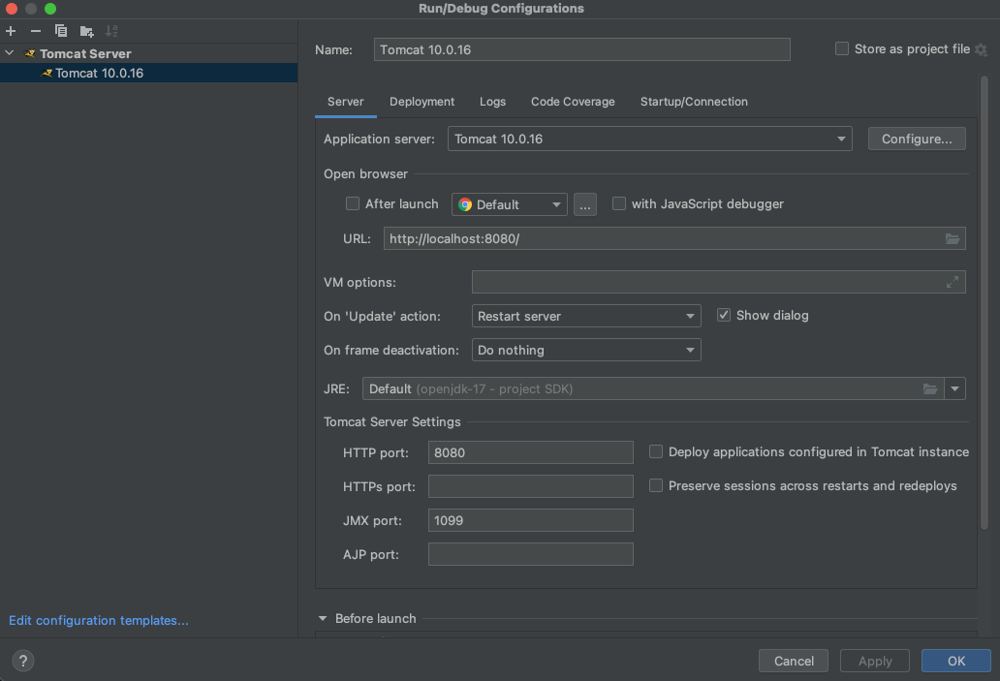
    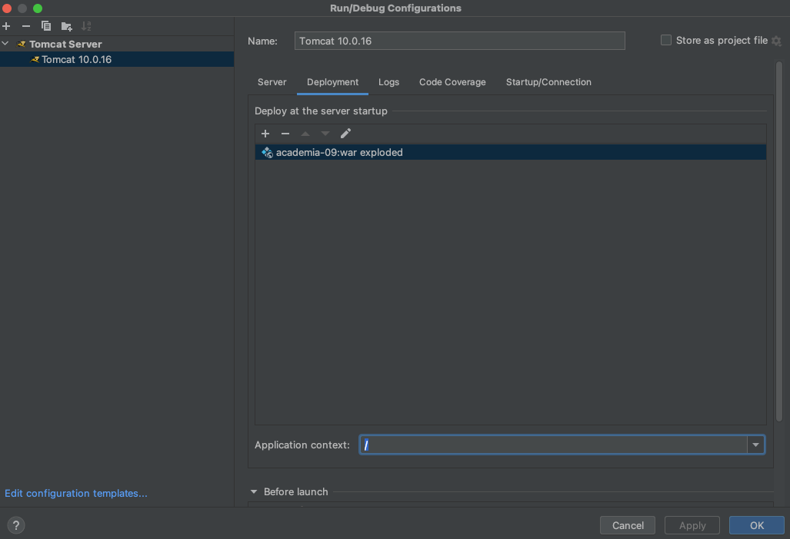

Then visit http://localhost:8080 in your favorite browser and the frontend will show up:
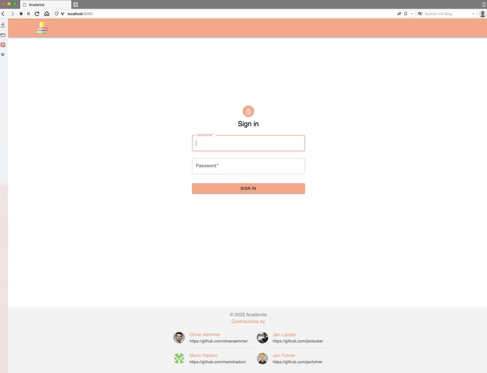

<div id="section9" style="page-break-before: always"/>

## 9. Conclusion

As mentioned in the "Design Decision" part, we decided to use the React JS framework **NextJS** to build our web frontend. This decision was made because we wanted to get a first experience with the big React world, which is used by many big web development companies. We then evaluated Google's large CSS library [Material UI](https://mui.com) for the design. 
In this chapter we will summarize the advantages and disadvantages of working with these frameworks / libraries.

NextJS offers some nice features:
- **CSS parser** - imports CSS files from a JavaScript file. New parsers improve CSS handling and show errors that would slip through before.
- **Fast refresh** - changes to React components are visible within seconds.
- **Built-in image component and automatic image optimization** - this feature automatically optimizes images.
- **Zero Config** - provides automatic compilation and bundling. In other words, it's optimized for production from the start.
- **Data fetching** - renders content in different ways, depending on the app's use case. This includes pre-rendering with server-side rendering or static page generation, as well as updating or creating content at runtime with incremental static regeneration.
- **Code splitting** - Reduce the size of your application's initial payload by splitting code and deploying components only when needed.
- **Rust-based compiler** - transform and minify JavaScript code for production. NextJS includes a brand new Rust compiler that has optimized bundling and compilation with ~3x faster local refreshes and ~5x faster builds for production.
- **Single Page Routing** - NextJS abstracts the mount / dismount action of components from React, which causes a really good development experience, as this is very complicated in React at first glance.

But there are also some disadvantages of NextJS we encountered for us:
- **Abstraction/Complexity** - The abstraction of ReactJS is very complicated, as we are not professionally involved in web development, and it took us some time to get used to it. We then completed the NextJS tutorial to start this application with a fairly practical launch structure. As development progressed, we learned new things about how React and NextJS handle things, and sometimes we had to rearrange all of our code.

The final conclusion for NextJS is that we had some difficulties at the beginning, but the more we worked with this framework, the more we understood how React / NextJS behaves. Overall, we achieved the main goal of this project by learning lots of new things and technologies. Also, we managed the whole workload and divided it into fair parts that each project member had to do.