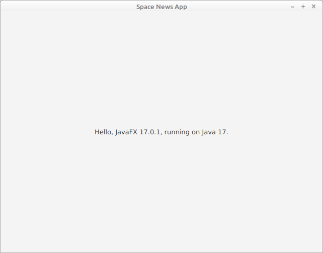

# Space News Project

## Tasks

Implement a JavaFX GUI application that displays the newest
messages (news, blogs or reports) provided by the Spaceflight news API (https://thespacedevs.com/snapi) .
The news messages are read using a JSON based API and displayed in a
table/list in a user-friendly way. The messages are retrieved online when
the application is started and can optionally be refreshed.
One chart containing statistics about the news messages
(e.g., number per time frame, number per news site, ...) is
generated from the retrieved messages.

The application should separate its view from a data model. The UI
should be internationalized with resource bundles (at least 2 languages
are supported).

Correct exception handling and clean code (e.g.,
no unused code, no TODO's, etc.) is mandatory.

It mandatory to build the application with a Maven. An example
POM file in the root of initial project structure is available, see below.
<!--- Details about grading can be found in the corresponding Moodle course.--->

## Evaluation Details

Basic Features (10 Points):

- Retrieving messages from the Spaceflight news API &rarr; 1 point
- News presented as table/list &rarr; 1 point
- 1 chart, e.g. news per time frame, or news per category &rarr; 1 point
- GUI supports 2 languages &rarr; 1 point
- Correct exception handling &rarr; 1 point
- Separation of view from data model &rarr; 1 point
- Clean code (no severe warnings/errors, no unused code, no TODO's) &rarr; 1 point
- Javadoc/Kdoc (public components have useful comments) &rarr; 1 point
- Working Maven build &rarr; 2 points

Additional Features (to compensate missing basic features):

- Refresh of news table/list: max. 1 point
- Additional Chart: max. 1 point
- Possibility to search the news by timeframe or given string: max. 1 point

&rarr; **Minimal Requirements: To pass 7 points must be reached !!!**

## Spaceflight news API

Documentation and examples from the API endpoints can be found on https://thespacedevs.com/snapi .

Here are same example API calls:

- https://api.spaceflightnewsapi.net/v3/articles : returns the 10 most recent articles
- https://api.spaceflightnewsapi.net/v3/articles/?_limit=100 : returns the 100 most recent articles
- https://api.spaceflightnewsapi.net/v3/articles/?_q=Kamala&_limit=100&_sort=publishedAt:DESC : 
  return the 100 most recent articles containing the String "Kamala"

More information about the API and the returned JSON objects can be found
here: https://api.spaceflightnewsapi.net/v3/documentation

## JavaFX application

A full-fledged, simple JavaFX application is given. The idea is, that
you substitute and/or enhance the given Java classes to build your own
application. Below, you'll find information for:

- Importing the sample project into Eclipse
- Importing the sample project into IntelliJ
- Building the sample application with Maven

## Importing the Project into Eclipse

Git-clone the sample application. Then import the application as a
Maven project ("Import..." -> "Maven" -> "Existing Maven Projects").

To run the sample application, select the Java source
file `HelloFX.java`, right-click and
select "Run As" -> "Java Application".

Initially, the sample application shows a simple window:



It is also possible to execute the sample JUnit test
class `AppTest` given
in the test directory. Select the Java source
file `AppTest.java`, right-click and
select "Run As" -> "JUnit Test".

## Importing the Project into IntelliJ

Git-clone the sample application. Then open/import the application
("Open or import" then navigate to the root of the sample
application).

To run the sample application, select the Java source
file `HelloFX.java`, right-click and
select "Run 'HelloFX.main()' ".

A window as shown above will be displayed.

It is also possible to execute the sample JUnit test
class `AppTest` given
in the test directory. Select the Java source
file `AppTest.java`, right-click and select "Run 'AppTest' ".


## Building the Sample Application with Maven

You are allowed to change the Java package name(s) and also the Java
module name. However, it must be possible to build your application at
any time with [Maven](http://maven.apache.org/) by following the steps
given below. It is assumed that you have installed Maven on your
computer.


### Compilation

To compile and build an executable JAR file, open a terminal window and
go to the root directory of this project. Then type:

```shell
$ mvn clean package
[a lot of output]
...
[INFO] ------------------------------------------------------------------------
[INFO] BUILD SUCCESS
[INFO] ------------------------------------------------------------------------
[INFO] Total time:  <....>
[INFO] Finished at: <....>
[INFO] ------------------------------------------------------------------------
```


### Execution

To run the (sample) JavaFX application, type:

```shell
$ mvn javafx:run
[some of output]
...
[INFO] ------------------------------------------------------------------------
[INFO] BUILD SUCCESS
[INFO] ------------------------------------------------------------------------
[INFO] Total time:  <....>
[INFO] Finished at: <....>
[INFO] ------------------------------------------------------------------------
```


### Code Quality

To check the quality of your code, you can execute [Checkstyle](). A
Checkstyle configuration file is given in your project under
`src/etc`. Type:

```shell
$ mvn checkstyle:check
[INFO] Scanning for projects...
[INFO] 
[INFO] ---------------------< ch.bfh:spacenews >----------------------
[INFO] Building spacenews 1.0
[INFO] --------------------------------[ jar ]---------------------------------
[INFO] 
[INFO] --- maven-checkstyle-plugin:3.1.1:checkstyle (default-cli) @ spacenews ---
[INFO] Beginne Prüfung... (the same in English of French...)
Prüfung beendet. (the same in English of French...)
[INFO] You have 0 Checkstyle violations.
[INFO] ------------------------------------------------------------------------
[INFO] BUILD SUCCESS
[INFO] ------------------------------------------------------------------------
[INFO] Total time:  1.129 s
[INFO] Finished at: 2020-10-14T15:49:56+02:00
[INFO] ------------------------------------------------------------------------
```

Watch if there are Checkstyle error/warnings. If so, correct them.


### Javadoc

You can generate Javadoc documentation. Type (don't forget to add `compile`):

```shell
$ mvn clean compile javadoc:javadoc
[INFO] Scanning for projects...
[INFO] 
[INFO] ---------------------< ch.bfh:newsreader >----------------------
[INFO] Building spacenews 1.0
[INFO] --------------------------------[ jar ]---------------------------------
[a lot of output]
...
[INFO] ------------------------------------------------------------------------
[INFO] BUILD SUCCESS
[INFO] ------------------------------------------------------------------------
[INFO] Total time:  1.129 s
[INFO] Finished at: 2020-10-14T15:49:56+02:00
[INFO] ------------------------------------------------------------------------
```

Watch if there are Javadoc error/warnings. If so, correct them.
